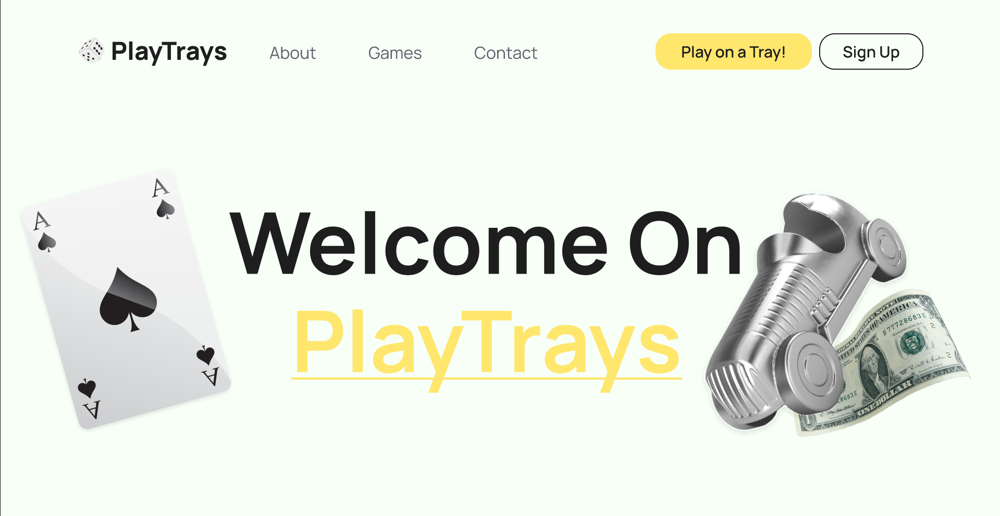

# PlayTrays

L'objectif est de développer une application de jeux sur plateau, ergonomique, moderne et ouverte à tout type 
de public.

## Crédits

Ce projet a été développé dans le cadre de notre cursus **préparatoire aux écoles d'ingénieurs de Polytech** en partenariat
avec l'**Université Savoie Mont Blanc** et est encadré par **Flavien VERNIER**.

L'application a été developpée par :
- **Joris VILARDELL** (aka ZUHOWKS)
- **Mathias HELLAL** (aka Majurax)
- **Mathilde VARAGNAT**
- **Othmane GARTANI**


# Développement du Front avec VueJS

Le site sera construit en 3 parties :
- La Landing Page (page vitrine)
- Le menu de l'interface jeu, pour sélectionner le jeu, accéder aux paramètres utilisateurs, etc
- L'interface en jeu

La première partie du développement s'acera sur la conception de la landing page. Ensuite, nous
procéderons à la réalisation de l'interface en jeu avec une interface du menu provisoire. Nous finaliserons
le site sur l'interface du menu de l'application, avec des fonctionnalités bonus : paramètre du compte, 
profil utilisateur, cosmetique.



*Preview de la section de bienvenue*


## Landing Page

La Landing Page sera découpé en plusieurs sections : About, Games (pour présenter les différents modes de
jeux), Contact.

**_État d'avancement :_**
- [x] Navbar
- [x] Welcome Section
- [x] About Section
- [ ] Games Section
- [x] Contact Section (en foot page)
- [x] Rendre fonctionnelle les boutons

## Interface jeu

Le but est de créer une interface jeu modulable, où seuls les modèles et les textures changent avec une 
configuration de caméra relative au mode de jeu. Pour créer notre scène 3D, nous utiliserons ThreeJS, une
bibliothèque JavaScript conçu pour la conception d'application 3D avancé compatible avec VueJS.

Nous aurons l'occasion de modéliser quelques jeux de plateau de manière que celle-ci soit utilisable
et intégrable à la partie back-end.

Certains élèments seront communs aux différents modes de jeux tels que l'UHD affichant des statistiques
relatives à la partie ou encore le scoreboard (affichant la liste des joueurs ainsi que leur stat). Aussi,
certaines choses devront être pensées de manière universelle par exemple les intéractions utilisateurs de bases
seront définies pour des touches spécifiques.

**_État d'avancement :_**
- [x] UHD
- [ ] Scoreboard
- [x] Scene 3D universelle
- [x] Modèle de partie universelle
- [x] Textures et modèles
- [x] Intégration du modèle de chacun des jeux
- [x] Intéractions utilisateurs

## Menu de l'Application

Le menu permet aux utilisateurs de sélectionner un jeu, créer des parties, rejoindre des parties public/privées ou via
un système de matchmaking.

Le but est de concevoir un Menu similaire aux applications mobiles, ergonomique et donnant l'illusion de rester constament
sur la même page.

**_État d'avancement :_**
- [x] Navbar
- [x] Grille de sélection des jeux
- [x] Interface réseau social
- [x] Système de matchmaking


# VueJS

## Recommended IDE Setup (VueJS Info)

[VSCode](https://code.visualstudio.com/) + [Volar](https://marketplace.visualstudio.com/items?itemName=Vue.volar) (and disable Vetur).

## Customize configuration (VueJS Info)

See [Vite Configuration Reference](https://vitejs.dev/config/).

## Project Command

### Compile et Hot-reload pour un rendu en temps réel

```sh
npm run dev
```

### Pour Compiler l'app

```sh
npm run build
```
